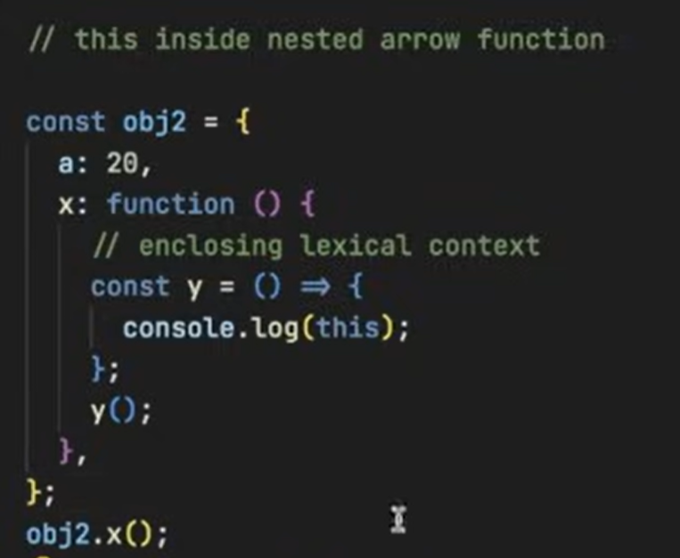

# `this` Keyword in JavaScript

---

## **Global Space**
- Anything outside of a function (on the top level of the code) is considered the **global space**.
- The `this` keyword in the global space refers to the **global object**.

```javascript
var a = 10;
```

**Global Object Examples:**
- In browsers: `window`
- In Node.js: `global`

---

## **Value of `this` in Global Space**
- It refers to the global object.
- The exact global object depends on the environment (browser or Node.js).

---

## **Strict Mode vs Non-Strict Mode**
- **Strict Mode** can be enabled by adding:
  ```javascript
  "use strict";
  ```
- Behavior of `this` inside a function:
  - **Non-strict mode:** `this` will refer to `window` (or global object).
  - **Strict mode:** `this` will be `undefined`.

**Why?**  
Due to **this substitution**:  
- If `this` is `undefined` or `null`, JavaScript replaces it with the global object in non-strict mode.

---

## **Function Calls and `this`**
```javascript
x();         // `this` = undefined (in strict mode)
window.x();  // `this` = window
```

---

## **`this` Inside an Object's Method**
- When `this` is used inside a method of an object, it refers to the **object itself**.

---

## **`this` Inside Arrow Functions**
- In an arrow function, `this` does not have its own value.
- It uses the value of `this` from the **enclosing lexical context**.
- In the global context, `this` in an arrow function will refer to the **global object**.

---

## **`this` in Nested Arrow Functions**
- The value of `this` depends on the **enclosing lexical scope** (the outer function).

---

## **`this` Inside DOM Elements**
- When used inside a DOM element's event handler, `this` refers to the **HTML element** that received the event.

---


